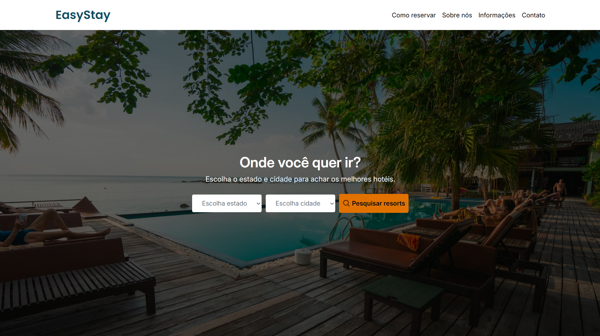

# 🏨 EasyStay - Mini Projeto

Mini projeto estático desenvolvido como parte de um curso de Tailwind CSS. O objetivo foi simular um site de busca e apresentação de hotéis, aplicando conceitos de layout responsivo, grid e flexbox, espaçamentos e tipografia usando o Tailwind CSS.

## 🚀 Tecnologias Utilizadas

-  **HTML5** → Estrutura semântica da página
-  **Tailwind CSS** → Estilização utilitária, layout responsivo e construção rápida de componentes visuais

## 🖼️ Demonstração

## 🔗 Link para o Deploy

[Acesse o projeto na Vercel](https://easy-stay-eight.vercel.app/)

## 🔧 Rodar localmente

Caso queira visualizar ou modificar o código localmente:

## 📄 Licença

Este é um projeto de estudo, criado com fins de aprendizado e sem fins comerciais.
